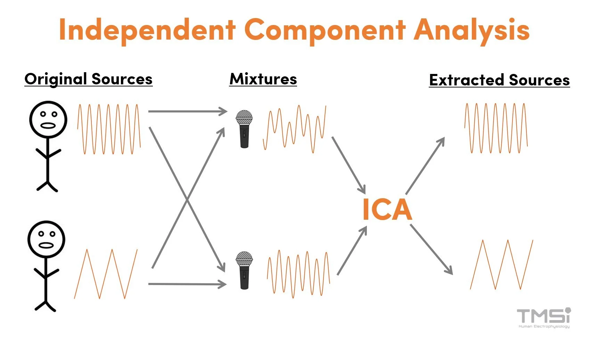

## From PCA to ICA: Why Decorrelation Is Not Enough

PCA finds an orthogonal basis that **decorrelates** the data — after projection, all pairwise covariances are zero. But **zero covariance does not imply statistical independence** in general.

Covariance measures only *linear* relationships (second-order statistics). Two variables can have zero covariance and still be highly dependent through nonlinear structure.

$$\text{independent} \implies \text{uncorrelated}, \quad \text{but} \quad \text{uncorrelated} \not\Rightarrow \text{independent}$$

> **The one exception:** If the data is jointly Gaussian, then uncorrelated *does* imply independent. This is because a multivariate Gaussian is fully characterized by its mean and covariance — there are no higher-order dependencies. So PCA is sufficient for Gaussian data, but fails for everything else.

**ICA** goes further: it finds directions along which the projected data is **maximally statistically independent**, not just uncorrelated.

*Source: [images.squarespace-cdn.com](https://images.squarespace-cdn.com/content/v1/673dcab4b177644177af9c16/4fbae5f2-b6b4-4d2b-aed2-d0bb9ef0b674/ICA+Image.jpg?format=2500w)*

## The Generative Model

ICA assumes the observed data $x$ is a **linear mixture** of hidden independent source signals $s$:

$$x = As$$

where:
- $x \in \mathbb{R}^d$ — observed signal (what you measure)
- $s \in \mathbb{R}^d$ — independent source signals (what you want to recover)
- $A \in \mathbb{R}^{d \times d}$ — unknown **mixing matrix**

The goal is to estimate the **unmixing matrix** $W = A^{-1}$ such that:

$$y = Wx \approx s$$

This is called **blind source separation (BSS)** — "blind" because both $A$ and $s$ are unknown.

**Cocktail party example:** Multiple speakers talk simultaneously. Each microphone records a *mixture* of all voices. ICA recovers the individual voices from the microphone recordings.

## Key Assumptions

ICA requires two assumptions:

1. **The sources are statistically independent:** knowing the value of one source tells you nothing about the others
$$p(s_1, s_2, \ldots, s_d) = \prod_i p_i(s_i)$$

2. **At most one source is Gaussian:** if two or more sources are Gaussian, they cannot be separated — their mixture is also Gaussian, and any rotation of a Gaussian is still Gaussian, so the unmixing direction is unidentifiable

3. **The mixing is linear and instantaneous** (the matrix $A$ is constant)

## How to Find Independent Components: The CLT Argument

The core insight comes from the **Central Limit Theorem (CLT)**:

> A sum (linear mixture) of independent random variables tends to be *more Gaussian* than any of the individual variables.

Therefore, the logic is reversed:

$$\text{Mixing} \longrightarrow \text{more Gaussian}$$
$$\text{Unmixing} \longrightarrow \text{less Gaussian (more non-Gaussian)}$$

$$\boxed{\text{Most non-Gaussian projection} \approx \text{original source signal}}$$

So instead of directly optimizing for statistical independence (which is hard to compute), ICA uses **non-Gaussianity as a proxy for independence**, and maximizes it.

## ICA as an Optimization Problem

We want to find a weight vector $w$ such that the projection $y = w^\top x$ is maximally non-Gaussian. This gives us one independent component. Repeating for all components gives the full unmixing matrix $W$:

$$\hat{W} = \arg\max_W \; \mathcal{F}_{\text{non-Gaussian}}(Wx) \quad \text{subject to } WW^\top = I$$

> ⚠️  When ICA's model assumptions hold (independent, non-Gaussian sources, linear mixing), ICA *does* recover the true sources — up to permutation and scaling (see Ambiguities below). The reason ICA is an optimization problem (unlike PCA's closed-form eigendecomposition) is that statistical independence involves *all orders* of statistics, not just second-order covariance. Non-Gaussianity is an approximation we optimize iteratively. If the model assumptions are violated, the result will be the "most non-Gaussian" directions, which are the best available approximation to independence.

## Measuring Non-Gaussianity

### 1. Kurtosis

Kurtosis is the normalized 4th central moment:

$$\text{Kurt}(y) = \mathbb{E}[y^4] - 3(\mathbb{E}[y^2])^2$$

For a Gaussian: $\text{Kurt}(y) = 0$

| Distribution | Kurtosis | Example |
|---|---|---|
| Gaussian | $= 0$ | noise |
| Super-Gaussian | $> 0$ | sparse signals, spiky (e.g., speech) |
| Sub-Gaussian | $< 0$ | uniform distributions, flat |

**Optimization:** maximize $|\text{Kurt}(w^\top x)|$

**Drawback:** kurtosis is sensitive to outliers (it weights the tails heavily via the 4th power), making it unstable in practice.

### 2. Negentropy

Negentropy is based on **differential entropy** $H$:

$$J(y) = H(y_{\text{Gaussian}}) - H(y) \geq 0$$

where $y_{\text{Gaussian}}$ is a Gaussian with the same mean and variance as $y$.

The Gaussian distribution has **maximum entropy** among all distributions with fixed variance. So negentropy measures how far a distribution is from Gaussian — it is always $\geq 0$ and equals zero only for a Gaussian.

**Optimization:** maximize $J(w^\top x)$

Negentropy is more robust than kurtosis but hard to compute exactly. In practice, it is approximated using nonlinear functions:

$$J(y) \approx \left[\mathbb{E}\{G(y)\} - \mathbb{E}\{G(\nu)\}\right]^2$$

where $\nu \sim \mathcal{N}(0,1)$ and $G$ is a nonlinear function such as:

$$G(u) = \log \cosh(u) \quad \text{or} \quad G(u) = -e^{-u^2/2}$$

## Typical pipeline

PCA whitening → ICA rotation

PCA is often used as a preprocessing step for ICA: it decorrelates and normalizes variance (whitening), leaving only the rotational degrees of freedom for ICA to solve.

## Limitations

- Only handles **linear** mixing — nonlinear mixtures require other methods
- Cannot separate **Gaussian** sources — the Gaussian distribution is rotationally symmetric, so all rotations look the same
- Results may be **local optima** — the optimization landscape for non-Gaussianity is non-convex
