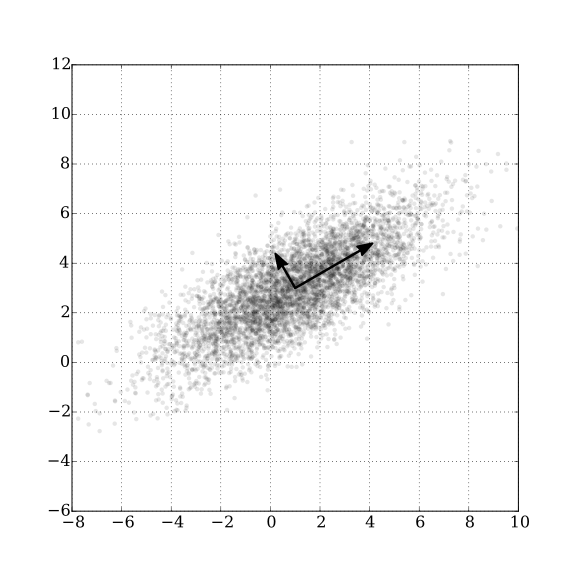

## What is PCA?

For a set of data points in high-dimensional space, PCA finds a sequence of directions (eigenvectors of the covariance matrix) such that:

- **PC1** is the direction of **maximum variance** across all data points
- **PC2** is the direction of maximum remaining variance, **orthogonal** to PC1
- **PC3**, **PC4**, ... continue greedily in the same way

Each direction is called a **principal component**. The amount of variance along each direction is given by the corresponding **eigenvalue** $\lambda_i$.

{width=60%}

*Source: [Wikipedia — Principal component analysis](https://en.wikipedia.org/wiki/Principal_component_analysis) (Wikimedia Commons, CC BY 2.5)*

## Why Use PCA for Dimensionality Reduction?

For an $N$-dimensional dataset, each data point lives in $\mathbb{R}^N$. But the data may not actually *use* all $N$ dimensions — the points might lie near a lower-dimensional subspace.

**Key idea:** If the variance along some direction is zero (or near zero), then all data points are essentially the same along that direction — so that direction carries no useful information and can be dropped.

**Extreme example:** Suppose you have 10 points in 2D, but they all lie on a line.

$$\text{2D space} \longrightarrow \text{1D description (the line direction)}$$

You only need *one* coordinate (the position along the line) to fully describe all 10 points. The perpendicular direction has zero variance and is discarded.

More generally, you keep the top $k$ principal components that explain most of the variance (e.g., 95%), and discard the rest.

## How to Do PCA

### Step 1 — Mean-center the data

Subtract the mean from each feature so the data is centered at the origin (see the last section for why).

### Step 2 — Compute the covariance matrix

For centered data matrix $X \in \mathbb{R}^{n \times d}$ ($n$ samples, $d$ features):

$$C = \frac{1}{n-1} X^\top X \quad \in \mathbb{R}^{d \times d}$$

$C$ is always **symmetric** and **positive semi-definite**.

### Step 3 — Eigendecomposition (via the Spectral Theorem)

By the **Spectral Theorem**, any real symmetric matrix can be decomposed as:

$$C = Q \Lambda Q^\top$$

where:
- $Q \in \mathbb{R}^{d \times d}$ is an **orthogonal** matrix whose columns are the eigenvectors $\{q_1, q_2, \ldots, q_d\}$
- $\Lambda = \text{diag}(\lambda_1, \lambda_2, \ldots, \lambda_d)$ is a diagonal matrix of eigenvalues, sorted $\lambda_1 \geq \lambda_2 \geq \cdots \geq \lambda_d \geq 0$

The eigenvectors $q_i$ are the **principal components** (new axes); the eigenvalues $\lambda_i$ are the **variances** along those axes.

### Step 4 — Project the data

To reduce to $k$ dimensions, take the top $k$ eigenvectors and project:

$$Z = X Q_k \quad \in \mathbb{R}^{n \times k}$$

where $Q_k$ contains only the first $k$ columns of $Q$.

### Connection to SVD

In practice, PCA is implemented using **Singular Value Decomposition (SVD)** rather than explicit eigendecomposition, because SVD is numerically more stable.

For the mean-centered data matrix $X$:

$$X = U \Sigma V^\top$$

where $U \in \mathbb{R}^{n \times n}$, $\Sigma \in \mathbb{R}^{n \times d}$ (diagonal, non-negative), $V \in \mathbb{R}^{d \times d}$ (orthogonal).

The covariance matrix then becomes:

$$C = \frac{1}{n-1} X^\top X = \frac{1}{n-1} V \Sigma^2 V^\top$$

Comparing with $C = Q \Lambda Q^\top$:

- The **right singular vectors** $V$ are the **principal components** (eigenvectors of $C$)
- The **singular values** $\sigma_i$ relate to eigenvalues by $\lambda_i = \sigma_i^2 / (n-1)$

So running SVD on $X$ directly gives you everything you need — no need to explicitly form $C$.

## Understanding PCA Through the Lens of Covariance

PCA learns a new orthogonal basis (the eigenvectors) such that, when data is projected onto this basis, **all pairwise covariances become zero**:

$$\text{Cov}(z_i, z_j) = 0 \quad \text{for } i \neq j$$

Recall:
$$\text{Cov}(x, y) = \mathbb{E}[(x - \mu_x)(y - \mu_y)]$$
$$\text{Corr}(x, y) = \frac{\text{Cov}(x, y)}{\sigma_x \sigma_y}$$

After PCA projection, the covariance matrix of the projected data $Z$ is diagonal:

$$\text{Cov}(Z) = \Lambda = \text{diag}(\lambda_1, \lambda_2, \ldots, \lambda_k)$$

This means: **projected dimensions are uncorrelated**. Each principal component captures an independent source of variation.

> ⚠️ Note: zero covariance means **linear** decorrelation. PCA does not remove higher-order (nonlinear) dependencies.

## Understanding PCA Geometrically

Think of your data as forming an **ellipsoid** in $d$-dimensional space. PCA is equivalent to rotating your coordinate axes to align with the axes of that ellipsoid.

- The **longest axis** of the ellipsoid → PC1 (maximum variance)
- The **second longest axis** → PC2 (perpendicular to PC1)
- And so on...

After the rotation, your data is expressed in the ellipsoid's natural coordinate system. Dropping the short axes (low-variance PCs) is equivalent to projecting the ellipsoid down to its most elongated face.

## Why Are Variances Always Ordered from Max to Min?

**Claim:** No unit direction $u$ can have higher variance than PC1.

**Proof sketch:** Since the eigenvectors $\{q_1, \ldots, q_d\}$ form an orthonormal basis, any unit vector $u$ can be written as:

$$u = \sum_i k_i q_i, \quad \text{with} \quad \sum_i k_i^2 = 1$$

The variance of the data projected onto $u$ is:

$$\sigma_u^2 = u^\top C u = \sum_i k_i^2 \lambda_i \leq \lambda_1 \sum_i k_i^2 = \lambda_1$$

Since $\lambda_1$ is the largest eigenvalue, the maximum variance achievable by *any* direction is $\lambda_1$, attained exactly when $u = q_1$.

Similarly, PC2 maximizes variance subject to $u \perp q_1$, giving $\lambda_2 \leq \lambda_1$, and so on. The ordering $\lambda_1 \geq \lambda_2 \geq \cdots$ is a consequence of this sequential constrained maximization.

## Why Subtract the Mean Before PCA?

Covariance is defined as:

$$\text{Cov}(x, y) = \frac{1}{n} \sum_i (x_i - \bar{x})(y_i - \bar{y})$$

If you don't subtract the mean first, you compute instead:

$$\frac{1}{n} \sum_i x_i y_i$$

which is the **second moment** — not the covariance. These are equal only when the mean is zero.

**What goes wrong in practice:** Without centering, PC1 will point in the direction of the mean (the "center of mass" of the data cloud) rather than the direction of greatest *spread*. The first component gets wasted describing where the data lives, not how it varies.

**Intuition:** Mean-centering moves the data cloud so its centroid sits at the origin. Only then does "distance from zero" equal "deviation from the mean," which is what variance actually measures.

## Summary

| Step | Operation | What it achieves |
|---|---|---|
| Mean-center | $X \leftarrow X - \bar{X}$ | Centers the data at origin |
| Covariance | $C = X^\top X / (n-1)$ | Captures pairwise linear relationships |
| Eigen/SVD decomposition | $C = Q\Lambda Q^\top$ | Finds directions of variance |
| Project | $Z = X Q_k$ | Reduces to $k$ dimensions |

**PCA in one sentence:** Find a rotation of the coordinate system such that each new axis points in a direction of decreasing variance, then keep only the axes that matter.
