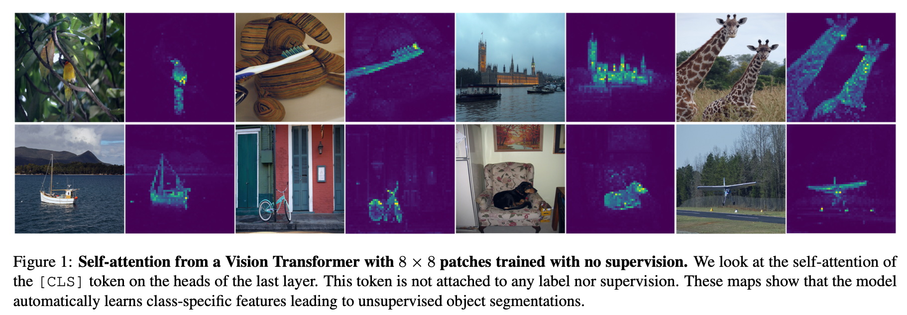

## Background

Before DINO, CNN-based self-supervised learning struggled to learn **semantic (object-level) representations** without supervision. The learned features tended to be texture- or color-based rather than capturing high-level object structure.

The key question is: *why* can ViTs learn better semantic representations? Unlike CNNs, which apply fixed local convolutions, ViTs allow every patch token to attend to every other patch, along with the self-supervised objective (DINO), enabling the model to integrate global context and reason about object-level structure from early in training.

---

## Core Idea: DINO

DINO (**Di**stillation with **No** labels) is a self-supervised learning framework that trains a Vision Transformer to produce semantically meaningful representations using two key mechanisms: **multi-crop training** and a **teacher-student architecture**.

### 1. Multi-Crop: Learning Parts and Wholes Together

Images are cropped at different scales, some crops cover the whole object, others cover only a small part (e.g., just a dog's head or leg). The model is trained to produce **similar embeddings** for all crops of the same image.

This encourages consistency across views, which often aligns with object-level semantics in practice. By aligning representations across scales, the model naturally develops semantic, object-level understanding rather than surface-level patterns.

### 2. Teacher-Student Architecture

The student network is trained to match the output of a teacher network. The teacher is not trained by gradient descent — instead, its weights are updated via **EMA (Exponential Moving Average)**:

$$W_t \leftarrow m \cdot W_t + (1 - m) \cdot W_s$$

The teacher follows the student slowly (large momentum $m$, e.g., 0.996), providing a stable and consistent training signal.

### 3. Loss: Cross-Entropy

The student is trained to match the teacher's output distribution using **cross-entropy loss**:

$$\mathcal{L} = -\sum_k P_t^{(k)} \log P_s^{(k)}$$

This is equivalent to minimizing the KL divergence between teacher and student distributions.

**Why cross-entropy over MSE?** Cross-entropy naturally focuses on the dimensions that the teacher assigns high probability to, rather than treating all dimensions equally. This makes it more sensitive to the structure of the learned representation.

---

## Preventing Collapse

A core challenge in self-supervised learning is **representation collapse** — the model learns trivial solutions where all inputs map to the same (or very similar) representations. DINO uses three complementary mechanisms to prevent this.

### Collapse Type 1: Full Collapse → EMA Teacher

If both networks were trained with gradient descent on the same objective, they would co-adapt and collapse together. Using an EMA teacher breaks this symmetry: the teacher provides stable targets that the student cannot trivially satisfy, without requiring negative pairs or contrastive loss.

### Collapse Type 2: Low-Diversity Outputs → Temperature Sharpening

Both teacher and student output probability distributions via softmax. **Temperature** controls the sharpness:

- **Lower temperature** → sharper, more one-hot-like distribution
- **Higher temperature** → softer, more uniform distribution

The **teacher uses a lower temperature** than the student, producing sharp and confident targets. This pushes the student to learn well-separated, discriminative representations — rather than spreading probability mass uniformly.

### Collapse Type 3: Dimensional Collapse → Centering

Dimensional collapse is a subtler failure mode where only a few embedding dimensions carry all information. DINO applies **centering** to the teacher's output before computing the loss:

$$g_t(x) \leftarrow g_t(x) - c, \quad c \leftarrow m_c \cdot c + (1 - m_c) \cdot \frac{1}{B}\sum_{x} g_t(x)$$

The center $c$ is a running mean of the teacher's outputs. Subtracting it prevents any single dimension from being systematically dominant, encouraging the model to use the full embedding space.

::: {.callout-note}
temperature sharpening encourages peaky (low-entropy) distributions, counteracting the tendency toward uniform collapse, while centering prevents any one dimension from dominating (resists the one-hot direction). Together they stabilize training.
:::

---

## Visualization: What Does DINO Learn?

One of DINO's most striking results is that its self-attention maps often align with object regions with no segmentation supervision.

To visualize this, we look at the **self-attention of the `[CLS]` token** in the last transformer layer. Concretely:

- The `[CLS]` token has shape `(batch_size, 1, d)`.
- The patch tokens have shape `(batch_size, 196, d)` (for a 14×14 grid on a 224×224 image).
- The attention weight from `[CLS]` to each patch is the corresponding row in the attention matrix $QK^T / \sqrt{d}$, giving us a $1 \times 196$ attention map per head.

This map tells us: *which patches does the model think are most relevant to the global image representation?*

Different attention heads learn different semantic features. A subset of the heads consistently attends to foreground objects, enabling simple unsupervised segmentation-like behavior. This emergent behavior is unique to ViTs trained with DINO and does not emerge as clearly in supervised ViTs or CNN-based models.

---

## Summary

| Component | Purpose |
|---|---|
| Multi-crop | Learn semantic consistency across scales |
| Teacher-student + EMA | Stable targets, avoid collapse |
| Temperature (teacher < student) | Sharp targets force discriminative features |
| Centering | Prevent dimensional collapse |
| Cross-entropy loss | Focus on informative dimensions |

DINO showed that ViTs, when trained with the right self-supervised objective, naturally develop object-level understanding — a property that had been elusive in CNN-based self-supervised methods.

**Paper:** Caron et al., [Emerging Properties in Self-Supervised Vision Transformers](https://arxiv.org/abs/2104.14294), ICCV 2021.
