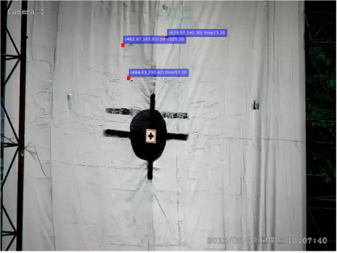
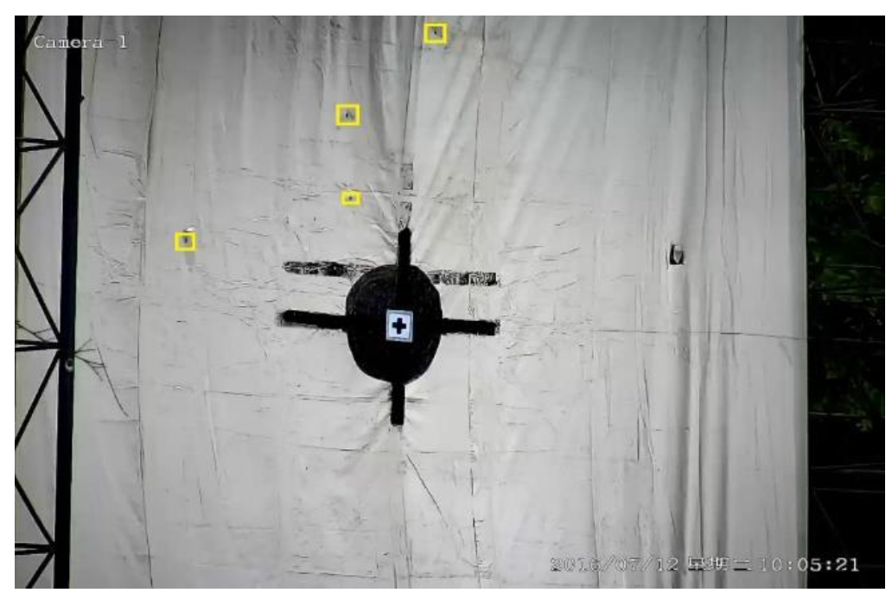
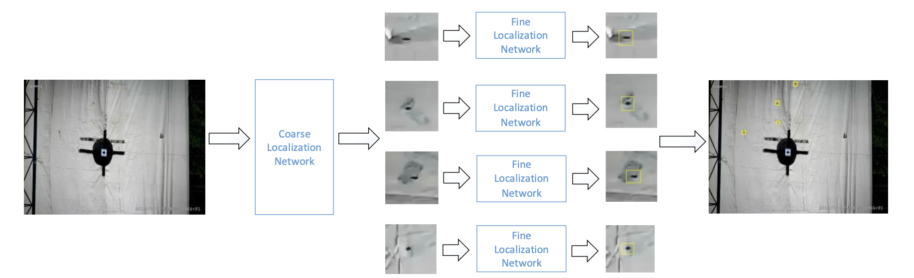
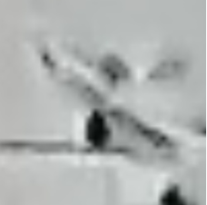
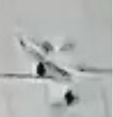
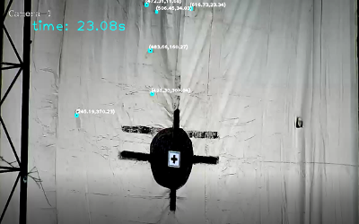
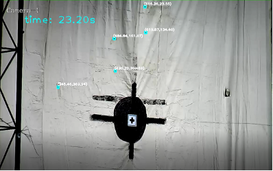
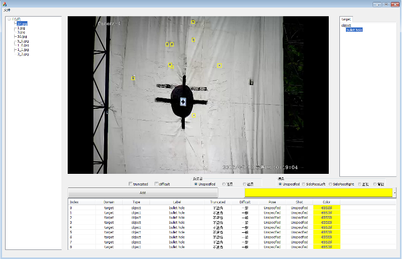

  

Abstract

  

Detecting small objects is challenging because of its low resolution and noisy representation. This paper focus on localize the bullet holes on a 4m*4m target surface and determine the shot time and position of new bullet holes on the target surface based on surveillance videos of the target. Under such a condition, bullet holes are extremely small compared with the target surface. In this paper, an improved model based on Faster-RCNN is proposed to solve the problem using two networks in series. The first network is trained using original video frames and obtain coarse locations of bullet holes, the second network is trained using the candidate locations obtained by the first network to get accurate locations. Experiment result shows that the series Faster-RCNN algorithm improves the average precision by 20.3% over the original Faster-RCNN algorithm on our bullet-hole dataset. To determine the shot time and improve detection accuracy, several algorithms have also been proposed, using these algorithms, detection accuracy of shot times and new shot points reaches the same level as human.

<video width="100%" autoplay loop muted playsinline controls >
  <source src="videos/bullet-hole-recognition.mp4" type="video/mp4">
</video>

 

## The Problem

On a military shooting range, soldiers fire at a large 4m x 4m target from a distance. After each round, someone has to physically walk up to the target to measure where the bullets landed and when. It is slow, dangerous during live fire, and error-prone.

I built a system that automates this process using only surveillance video. Given a video of the target, the system outputs the precise location and timestamp of each new bullet impact, matching human-level accuracy.

## Why It's Hard

**Extremely small targets.** The video frames are 1280x960 pixels, but each bullet hole occupies only about 10x10 pixels. Standard object detectors like Faster R-CNN lose spatial precision through repeated convolution and pooling, making them poorly suited for objects this small.

**Cluttered background.** The target is never clean. Dozens of old bullet holes from previous sessions already cover the surface before a new round begins. The system must distinguish a *fresh* impact from all the pre-existing ones.

{width=60%}

## Approach: Series Faster-RCNN

Rather than trying to detect tiny bullet holes in a single pass, I designed a two-stage cascaded pipeline built on Faster-RCNN:

**Stage 1 (Coarse Localization).** A Faster-RCNN model with a ZF backbone scans the full video frame and produces rough bounding boxes around candidate bullet holes.

**Stage 2 (Fine Localization).** Each candidate box (~20x20 px) is expanded by 15 pixels on each side, then upsampled 10x to ~500x500 px. A second Faster-RCNN model re-detects the bullet hole within this zoomed-in patch. The refined coordinates are then mapped back to the original frame.

::: {layout-ncol=2}

:::

## Detecting New Impacts in Video

Each video contains exactly 3 shots. Detecting all bullet holes per frame is only half the job; the real task is figuring out *which* holes are new. I combined four filtering methods:

**Pixel comparison.** For each detected hole, compare the dark-pixel count in the same region between consecutive frames. A sudden spike in black pixels signals a new impact.

::: {layout-ncol=2}

:::

**Bullet-hole tracking.** Track existing holes across frames using Euclidean distance matching (threshold = 10 px). This links detections over time and separates persistent holes from transient noise.

**Appearance frequency.** Count how many frames each candidate persists. Real bullet holes appear stably across hundreds of frames; insects or detection noise are short-lived and get filtered out.

**NMS filtering.** A final non-maximum suppression pass removes duplicate entries caused by intermittent tracking failures.

## Annotation GUI

To build the training dataset, I developed a custom annotation tool that lets annotators label bullet hole bounding boxes directly on video frames. The GUI supports frame-by-frame navigation, bounding box drawing, and export to Pascal VOC XML format — the format used to train both stages of the cascaded network.

## Results

| Model | Average Precision |
|---|---|
| Faster R-CNN alone | 63.2% |
| Series network (coarse + fine) | **83.5%** |

The cascaded approach improved detection accuracy by **20.3 percentage points** over the single-network baseline.

For the video-level task of identifying new shot times and positions, the system achieved **100% accuracy** across all videos in the dataset, matching human annotation exactly.

| Video | Manual annotation (sec) | Our method (sec) |
|---|---|---|
| 1 | (23, 57, 105) | (23, 57, 105) |
| 2 | (51, 75) | (51, 75) |
| 3 | (15, 49) | (15, 49) |
| 4 | (18) | (18) |

## Tech Stack

Python, Caffe (custom-compiled Faster-RCNN), ZF network backbone, Pascal VOC annotation format. The ZF model was chosen deliberately over deeper architectures (e.g., VGG16) to preserve spatial resolution for small-object detection.

---

*Published as: Du, F., Zhou, Y., Chen, W., & Yang, L. "Bullet Hole Detection Using Series Faster-RCNN and Video Analysis." Proceedings of the 2017 IEEE International Conference on Computer Vision (ICCV), 2017.*
