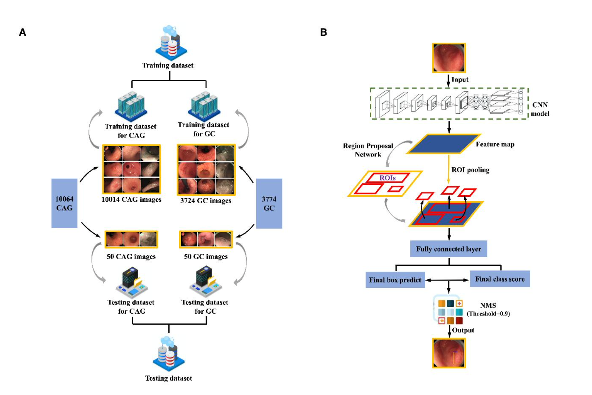
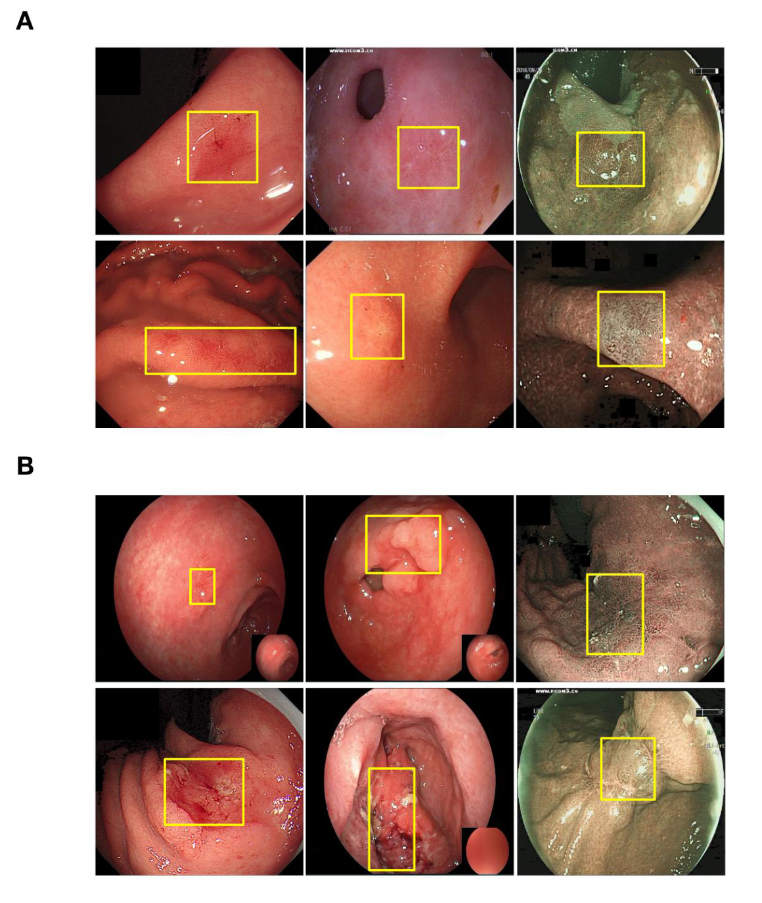
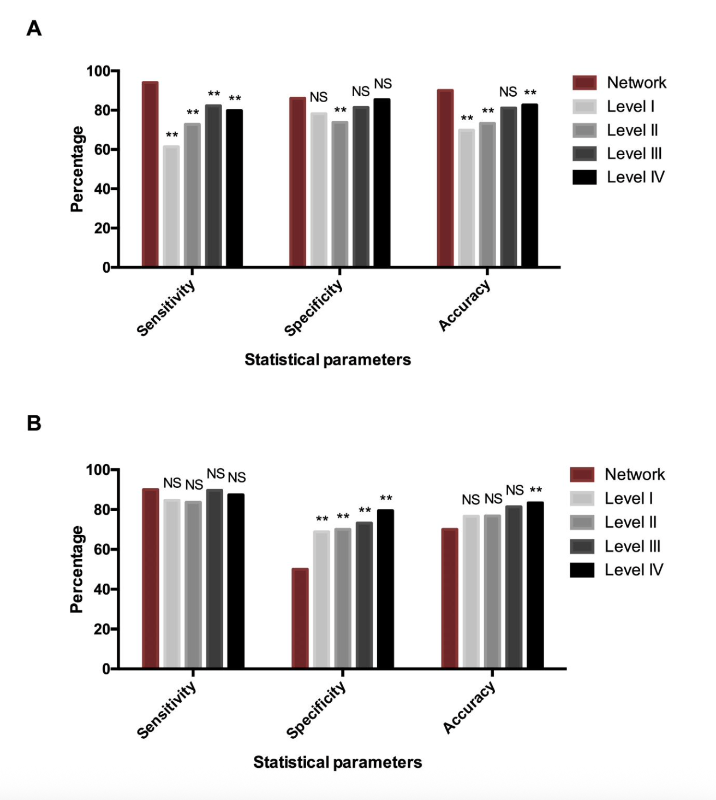

*A Faster R-CNN system that matches or exceeds expert endoscopists in detecting chronic atrophic gastritis, trained on 13,000+ clinical endoscopic images.*

---

## The Problem

Gastric cancer is the fifth most common cancer worldwide and the third leading cause of cancer death. The 5-year survival rate for early-stage gastric cancer exceeds 90%, but drops below 20% for advanced cases. Early detection is everything.

The precursor to most gastric cancers is chronic atrophic gastritis (CAG), a condition where the stomach lining gradually deteriorates. Catching CAG early means catching cancer early. But CAG lesions are subtle: they present as diffuse, delicate changes in the mucosa that are easily missed under standard white-light endoscopy. Studies report miss rates around 8% even in clinical settings.

We built a real-time, CNN-based detection system that helps endoscopists spot these lesions during live procedures, using only standard white-light imaging with no need for expensive specialized equipment.

## My Role

I contributed to the deep learning methodology and model development for this project, which was a collaboration between the Communication University of China and Beijing Friendship Hospital. The clinical team provided the endoscopic image database and expert annotations; our team designed and trained the detection networks.

## Approach

We adapted Faster R-CNN with two backbone architectures: a 5-layer ZF model and a 13-layer VGG16 model. Both were pre-trained on ImageNet and fine-tuned end-to-end on our clinical datasets.

{width=80%}

*Left: composition of training and testing datasets for CAG and GC. Right: the two-stage Faster R-CNN detection pipeline, from feature extraction through region proposal to final classification.*

The key design choices:

- **End-to-end training.** We modified the standard 4-step alternating Faster R-CNN training into a single end-to-end process for faster convergence and better detection quality.
- **Image-centric sampling.** Mini-batches of 256 anchors were sampled from each image with a 1:1 positive-to-negative ratio.
- **Task-specific model selection.** VGG16 performed best for CAG (diffuse, texture-level changes), while ZF performed best for GC (more localized, structural lesions).

## Dataset

The training data came from a clinical endoscopic database at Beijing Friendship Hospital, spanning 2013 to 2017:

- **CAG:** 10,014 annotated training images, with histological confirmation via the Updated Sydney System
- **GC:** 3,724 annotated training images (including 1,540 early gastric cancer), endoscopically confirmed by certified GI experts

All images were annotated by six experienced endoscopists using a back-to-back protocol. Disagreements (364 CAG images, 92 GC images) were resolved through group discussion.

{width=60%}

*Top: annotated CAG training examples with bounding boxes at biopsy sites. Bottom: annotated GC training examples. Yellow boxes indicate lesion regions.*

## Results

### CAG Detection: Outperformed 77 Endoscopists

| | Sensitivity | Specificity | Accuracy |
|---|---|---|---|
| **Our model (VGG16)** | **95%** | **86%** | **90%** |
| Avg. of 77 doctors | 74% | 82% | 78% |
| Level IV experts (15+ yrs) | 80% | 85% | 83% |

The model exceeded even the most senior endoscopists across all three metrics, with statistically significant improvements in sensitivity and accuracy.

### GC Detection: High Sensitivity, Trade-off in Specificity

| | Sensitivity | Specificity | Accuracy |
|---|---|---|---|
| **Our model (ZF)** | **90%** | 50% | 70% |
| Avg. of 89 doctors | 87% | 74% | 80% |

The model achieved slightly higher sensitivity than the average doctor (catching more true cancers), but at the cost of lower specificity (more false alarms). In a clinical screening context, this trade-off is arguably acceptable: flagging a suspicious region for biopsy is far less costly than missing a cancer.

{width=60%}

*Comparison of diagnostic performance between the network and doctors stratified by seniority (Level I to IV). (A) CAG detection. (B) GC detection.*

## Clinical Significance

This system is designed to integrate directly into existing endoscopic workflows with no hardware changes required. It works with standard white-light imaging, making it accessible to primary health centers that cannot afford narrow-band imaging or magnifying endoscopy. The intended use cases include assisting less experienced endoscopists in real-time lesion detection and guiding targeted biopsy site selection.

## Tech Stack

Python, Caffe, Faster R-CNN (end-to-end training), ZF and VGG16 backbones, ImageNet pre-training. Dataset annotation followed a structured clinical protocol with multi-expert cross-validation.

---

*Published as: Chen, L.\*, Zhu, S.\*, Chen, W.\*, Min, L., Zhao, Y., Du, F., et al. "Gastroenterologist-level detection of gastric precursor lesions and neoplasia with a deep convolutional neural network." Medical Robotics, 1(1), 2023. (\*equal contribution)*
