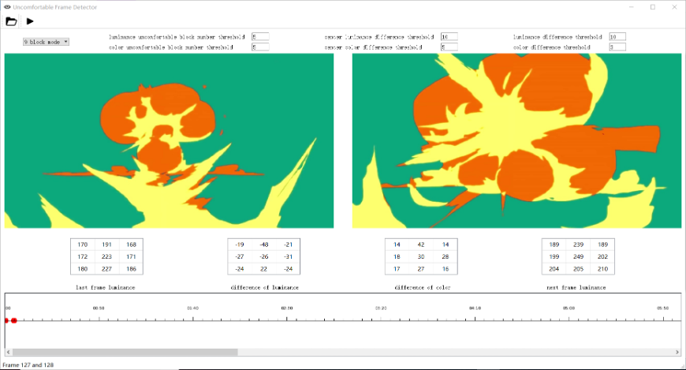
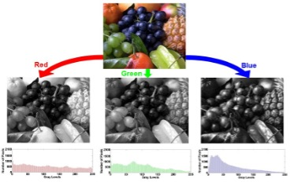

## Overview

Large outdoor displays and digital signage are everywhere in public spaces. Dramatic contrast changes in the content they play can cause uncomfortable visual feelings for people passing by. That's exactly the problem **VisualScore** was designed to detect and quantify.

During my undergraduate work, I built a Python-based tool that automatically evaluates the **visual comfort** of video files and image sequences by analyzing luminance changes across frames. The program identifies frames with jarring brightness transitions and produces an overall comfort score, useful for display quality assessment and content compliance testing.

## What It Does

VisualScore takes a video file or a folder of images as input and performs three main tasks:

**Luminance extraction.** Each frame is converted to a luminance map at a user-specified resolution, transforming raw RGB pixels into perceptual brightness values for consistent comparison.

**Block-wise comfort detection.** The frame is divided into spatial blocks (e.g., a 3×3 grid), and the average luminance of each block is compared across adjacent frames. If enough blocks exceed a brightness-difference threshold, that frame pair is flagged as "uncomfortable." The center region is weighted more heavily to reflect the human visual system's foveal sensitivity.

**Comfort scoring.** Taking into account the number of flagged transitions, the magnitude of luminance differences, display properties (peak brightness, screen size, viewing angle), and environmental lighting conditions, the program computes a final comfort score for the entire video or image sequence.

## Under the Hood

The keyframe extraction pipeline uses two classical algorithms to detect abrupt visual changes between consecutive frames:

**Sum of Absolute Differences (SAD)** performs pixel-wise subtraction between adjacent frames and averages the result. It is simple and directly sensitive to any brightness or content shift.

**Histogram Differences (HD)** compares the luminance distribution of consecutive frames. By looking at the overall shape of each channel's histogram rather than individual pixels, it captures global tonal shifts that pixel-level methods might miss.

All configurable parameters (block count, luminance threshold, frame comparison range, and display properties) are centralized in a single config file for easy tuning. The output is a structured result file listing every detected uncomfortable frame pair, along with the number of flagged blocks and per-block luminance differences.

## Demo

<video width="100%" autoplay loop muted playsinline controls>
  <source src="images/VisualScore.mp4" type="video/mp4">
</video>

## Tech Stack

Python, OpenCV, NumPy.

